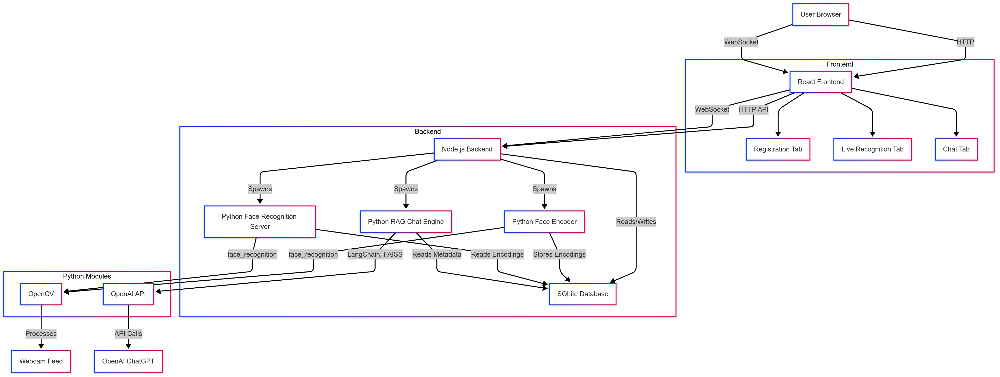

<<<<<<< HEAD
# Face Recognition Platform with Real-Time AI Q&A

This repository contains a **browser-based face recognition platform** developed for the **Katomaran Hackathon, May 2025**.  
The platform enables users to:
- Register faces
- Perform real-time face recognition via webcam
- Query registration details via a chat interface powered by Retrieval-Augmented Generation (RAG)

---

## 🚀 Features

- **Registration Tab:**  
  Capture face images via webcam, assign names, and store facial encodings with metadata in an SQLite database.

- **Live Recognition Tab:**  
  Stream webcam feed, recognize multiple faces in real-time, and overlay bounding boxes with names and confidence scores.

- **Chat Query Interface:**  
  Query face registration details (e.g., last registered person, registration time, total registered faces) using a WebSocket-based chat powered by **LangChain**, **FAISS**, and **OpenAI's ChatGPT API**.

---

## 🧰 Tech Stack

| Module              | Technology                                      |
|---------------------|--------------------------------------------------|
| Frontend            | React.js                                         |
| Backend             | Node.js (Express, WebSocket)                    |
| Face Recognition    | Python (face_recognition, OpenCV)               |
| RAG (Q&A)           | Python (LangChain, FAISS, OpenAI ChatGPT)       |
| Database            | SQLite                                           |
| Logging             | Winston (Node.js), Python `logging` module       |

---

## ✅ Prerequisites

- Node.js (v16 or higher)
- Python (v3.8 or higher)
- SQLite
- Webcam (for face capture and recognition)
- OpenAI API key (to be set in a `.env` file)

---

## 🔧 Setup Instructions

### 1. Clone the Repository

```bash
git clone https://github.com/PoorvikaGowda23/22PD10_Katomaran2025.git

```

### 2. Backend Setup (Node.js)

```bash
npm install
```

Create a `.env` file in the root directory:

```
OPENAI_API_KEY=your_openai_api_key
```

Start the backend server:

```bash
npm start
```

### 3. Frontend Setup (React)

```bash
cd frontend
npm install
npm start
```

Frontend runs on: [http://localhost:3000](http://localhost:3000)

### 4. Python Dependencies

```bash
pip install -r requirements.txt
```

**Required packages:**
- face_recognition  
- opencv-python  
- langchain  
- langchain-openai  
- langchain-community  
- faiss-cpu  
- python-dotenv  
- tenacity  
- numpy  

---

## 🗃️ Database

- SQLite database: `face_database.db`  
- Automatically created on first run  
- Ensure the database file is writable by the application

---

## ▶️ Running the Application

1. Ensure the **Node.js server** is running:
   ```bash
   npm start
   ```

2. Open the frontend in your browser:
   [http://localhost:3000](http://localhost:3000)

3. Use:
   - **Registration Tab** to register faces  
   - **Live Recognition Tab** for real-time detection  
   - **Chat Tab** to query face registration info

---

## 🧠 Assumptions

- **Webcam Availability:** Webcam must be functional for face capture and recognition.
- **Single Face per Registration:** One face per image to simplify encoding and storage.
- **Frame Processing Rate:** 1–2 frames/sec to balance performance on standard laptops.
- **Database:** Uses SQLite for portability and simplicity.
- **Network:** Assumes local environment (localhost:5000 for backend, 3000 for frontend).
- **OpenAI API:** Users need to supply their own API key.
- **Error Handling:** Errors are logged using Winston and Python logging, some logs shown only in console to maintain UI clarity.

---

## 🏗️ Architecture Diagram
   
    

---

## 🎥 Demo Video

**Video Demonstration:**  
Includes:
- Registering a face
- Performing real-time recognition
- Querying details via the chat interface  
➡️ Walkthrough of the UI, live detection overlays, and sample chat Q&A

     [OutputVideo](OutputVideo/22PD10_Katomaran_Hackathon.mp4)
---

## 📋 Logging

| Component     | Log File               | Description                                |
|---------------|------------------------|--------------------------------------------|
| Node.js       | `app.log`              | Logs using Winston (console + file)        |
| Python (face) | `face_recognition.log` | Logs encoding, detection, errors, info     |
| Python (RAG)  | `chat_rag.log`         | Logs RAG query execution and errors        |

- Timestamps, levels (info/warn/error), and debug messages included.

---
=======
# face---rag
>>>>>>> be7958dd7422bbb458682e0b66984f043146f7b2
